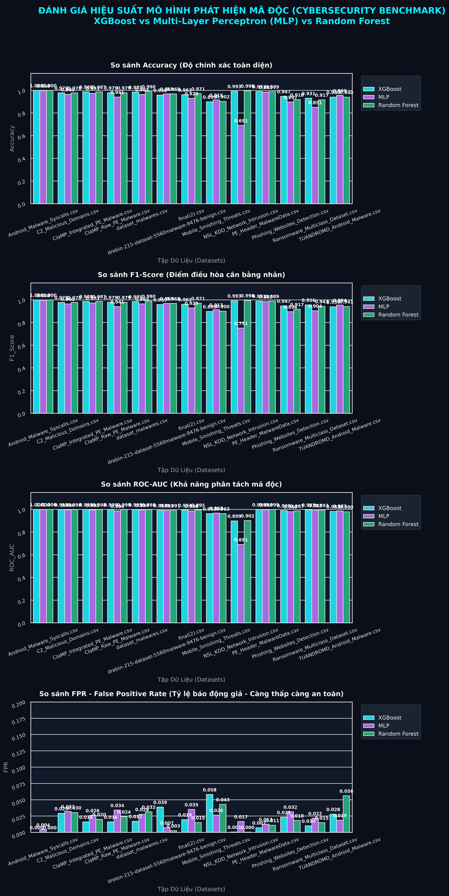
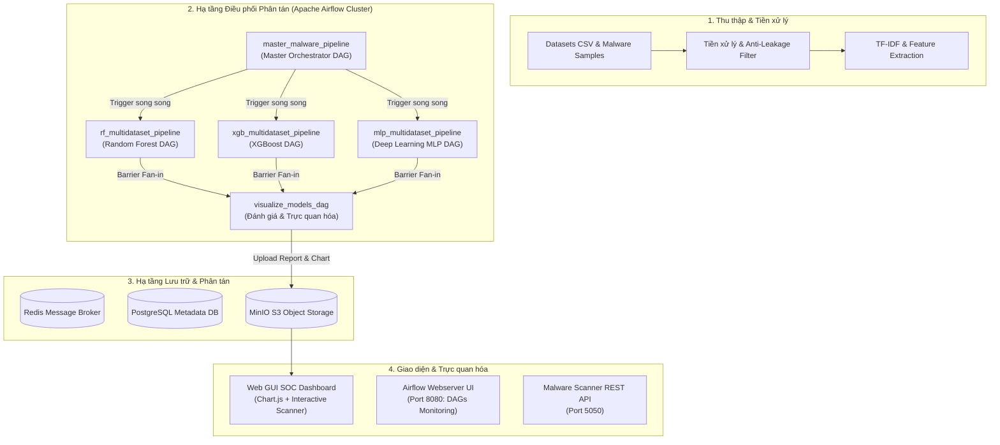

# 🛡️ SecMLOps Platform: Automated Malware Detection & Model Evaluation with Apache Airflow & Docker

[](https://airflow.apache.org/)
[](https://www.docker.com/)
[](https://min.io/)
[](https://www.python.org/)
[](https://scikit-learn.org/)
[](https://thanhan2710.github.io/air_flow/)

Hệ thống **SecMLOps (Machine Learning Operations cho An ninh mạng)** tự động hóa toàn diện quy trình thu thập dữ liệu, tiền xử lý chống rò rỉ nhãn (Anti-Data Leakage), huấn luyện phân tán và đánh giá so sánh hiệu năng của **3 kiến trúc mô hình học máy** (Random Forest, XGBoost, Multi-Layer Perceptron) trên nền tảng **Apache Airflow, Celery Worker, MinIO S3 Object Storage và Docker**.

---

## 🌐 Trải nghiệm Trực tiếp Giao diện (Live Interactive GUI Dashboard)

Toàn bộ giao diện trực quan hóa dữ liệu mô hình và công cụ quét mã độc tương tác đã được triển khai sẵn tại GitHub Pages:

👉 **[Bấm vào đây để mở Trực tiếp Giao diện Dashboard (Live Demo)](https://thanhan2710.github.io/air_flow/)**



---

## 📑 Báo cáo Kỹ thuật Chuyên sâu
Dự án đi kèm báo cáo học thuật và kỹ thuật đầy đủ chi tiết tại:
- 📖 [BÁO CÁO KỸ THUẬT CHUYÊN SÂU CHƯƠNG 2 & 3 (BAO_CAO_CHIEU_SAU_CHUONG_2_VA_3.md)](BAO_CAO_CHIEU_SAU_CHUONG_2_VA_3.md)

---

## 🏛️ Kiến trúc Hệ thống (System Architecture)



---

## 📂 Danh mục Đường ống Dữ liệu (Airflow DAGs Catalog)

| Tên DAG | Tập tin | Mô tả chức năng |
| :--- | :--- | :--- |
| **`master_malware_pipeline`** | [master_malware_pipeline.py](dags/master_malware_pipeline.py) | **DAG Điều phối Trưởng (Master Orchestrator)**: Kích hoạt đồng thời 3 pipeline học máy song song và đồng bộ rào cản (barrier fan-in) kích hoạt DAG đánh giá. |
| **`rf_multidataset_pipeline`** | [rf_multidataset_pipeline.py](dags/rf_multidataset_pipeline.py) | Pipeline huấn luyện và kiểm định mô hình **Random Forest** tối ưu trên đa tập dữ liệu an ninh mạng. |
| **`xgb_multidataset_pipeline`** | [xgb_multidataset_pipeline.py](dags/xgb_multidataset_pipeline.py) | Pipeline huấn luyện và kiểm định mô hình **XGBoost** với cân bằng trọng số lớp và xử lý đặc trưng phi tuyến. |
| **`mlp_multidataset_pipeline`** | [mlp_multidataset_pipeline.py](dags/mlp_multidataset_pipeline.py) | Pipeline huấn luyện mạng nơ-ron học sâu **Multi-Layer Perceptron (MLP)** với cơ chế chống rò rỉ thông tin dữ liệu. |
| **`visualize_models_dag`** | [visualize_models_dag.py](dags/visualize_models_dag.py) | Thu thập các file CSV báo cáo, tính toán ma trận tương quan, sinh biểu đồ 300 DPI (PNG/PDF) và đồng bộ Web Dashboard lên MinIO S3. |
| **`real_malware_pipeline`** | [real_malware_pipeline.py](dags/real_malware_pipeline.py) | Phân tích file thực thi PE mã độc thực tế, bóc tách đặc trưng header/section tĩnh và gán nhãn kết quả. |
| **`stock_pipeline_dag`** | [stock_pipeline_dag.py](dags/stock_pipeline_dag.py) | Pipeline thử nghiệm phân tích và dự báo chuỗi thời gian chứng khoán với Random Forest. |

---

## 🛠️ Các Thành phần Bổ trợ & Dịch vụ

- **`scanner_engine.py`**: Trích xuất đặc trưng PE Header, kích thước section, entropy và đưa qua bộ scaler để phân loại với 3 mô hình đã huấn luyện.
- **`scanner_api.py`**: Dịch vụ REST API chạy tại cổng `5050`, phục vụ các yêu cầu quét tệp từ Web Dashboard trực tuyến với hỗ trợ CORS đầy đủ.
- **`dags/reports/index.html` & `docs/index.html`**: Giao diện SOC Dashboard tương tác đầy đủ, hỗ trợ chọn chỉ số (Accuracy, F1-Score, Precision, FPR, ROC-AUC), lọc theo tập dữ liệu và tải báo cáo tổng hợp.

---

## 🚀 Hướng dẫn Cài đặt & Khởi chạy (Quickstart)

### 1. Yêu cầu Tiền đề
- **Docker** & **Docker Compose** (phiên bản v2.0+)
- Tối thiểu 4GB RAM khả dụng cho Docker Daemon

### 2. Tải mã nguồn & Chuẩn bị môi trường
```bash
git clone https://github.com/thanhan2710/air_flow.git
cd air_flow

# Tạo file cấu hình môi trường từ mẫu
cp .env.example .env
```

### 3. Build & Khởi chạy toàn bộ Cụm Dịch vụ với Docker Compose
```bash
# Build custom Airflow image (bao gồm tất cả dependencies)
docker compose build

# Khởi động Airflow, Postgres, Redis, Celery Worker, MinIO, Scanner API
docker compose up -d
```

> **Lưu ý**: Lần chạy đầu tiên sẽ mất khoảng 3-5 phút để cài đặt dependencies và khởi tạo database.

### 4. Huấn luyện mô hình phát hiện mã độc (Lần đầu tiên)
Sau khi các container đã khởi động thành công, bạn cần huấn luyện mô hình để Scanner API hoạt động:
```bash
# Chạy script huấn luyện bộ 3 mô hình (Random Forest, XGBoost, MLP) bên trong container
docker compose exec airflow-worker python /opt/airflow/dags/train_detector_models.py
```
> Script này sẽ tạo ra các file model (`.pkl`) trong `dags/models/` để Scanner API sử dụng cho việc phân tích mã độc thời gian thực.

### 5. Truy cập các Giao diện Quản trị
Sau khi các container hoàn tất khởi động (khoảng 2-3 phút):

| Dịch vụ | Địa chỉ URL | Tài khoản mặc định | Chức năng |
| :--- | :--- | :--- | :--- |
| **Airflow Web UI** | `http://localhost:8081` | `airflow` / `airflow` (hoặc cấu hình trong `.env`) | Giám sát và kích hoạt các DAGs, xem Graph View, Grid View, Logs |
| **Shield-AI Dashboard** | `http://localhost:5050` | *(Tự do)* | Giao diện đánh giá mô hình & quét mã độc thời gian thực |
| **MinIO Console** | `http://localhost:9001` | `minioadmin` / `minioadmin` | Trực quan hóa kho lưu trữ Object Storage, xem model & report buckets |
| **Flower Dashboard** | `http://localhost:5555` | *(Không yêu cầu, cần thêm `--profile flower`)* | Giám sát trạng thái hoạt động của cụm Celery Workers |
| **Malware Scanner API** | `http://localhost:5050/api/health` | *(REST API)* | API tiếp nhận file thực thi và phân tích mã độc thời gian thực |
| **Web SOC Dashboard (MinIO)** | `http://localhost:9000/malware-evaluation/dashboard.html` | *(Tự do)* | Giao diện phân tích đa chỉ số đồ họa cao (sau khi chạy pipeline) |


---

## 🌐 Cách Đưa Giao Diện UI lên GitHub Pages

Để đưa giao diện Web UI Dashboard lên hoạt động trực tiếp trên link GitHub của bạn (`https://thanhan2710.github.io/air_flow/`):

1. Truy cập vào trang quản trị repo: [Settings -> Pages](https://github.com/thanhan2710/air_flow/settings/pages)
2. Tại mục **Build and deployment**:
   - **Source**: Chọn `Deploy from a branch`
   - **Branch**: Chọn nhánh `main`, chọn thư mục `/docs`
   - Bấm **Save**
3. Đợi khoảng 1 phút, GitHub Pages sẽ kích hoạt và cung cấp đường dẫn truy cập công khai cho bất kỳ ai!

---

## 📊 Danh mục Tập dữ liệu & Phạm vi Giám sát (Datasets Catalog)

Hệ thống được mở rộng và huấn luyện trên **19 tập dữ liệu an ninh mạng** toàn diện, bao gồm **~50MB dữ liệu mới bổ sung** để lấp đầy các góc khuất an ninh:

| Tập dữ liệu mới bổ sung (~50MB) | Dung lượng | Số mẫu | Phạm vi an ninh khắc phục / Bổ sung |
| :--- | :---: | :---: | :--- |
| **`CIC_MalMem2022_Obfuscated.csv`** | **15.66 MB** | 58,596 | **Mã độc bộ nhớ & Không file (Fileless / Obfuscated Malware)**: Giám định memory dumps, thread ẩn, DLL injection, callbacks, VAD. |
| **`APA_DDoS_Traffic.csv`** | **20.72 MB** | 151,200 | **Tấn công từ chối dịch vụ phân tán (DDoS)**: Nhận diện luồng tấn công tầng ứng dụng và bất thường băng thông. |
| **`Ransomware_PE_Headers.csv`** | **5.08 MB** | 2,157 | **Cấu trúc PE chuyên sâu Mã độc tống tiền**: Phân tích 1024 đặc trưng byte & header nhị phân của các chủng Ransomware. |
| **`SQL_Injection_Payloads.csv`** | **2.18 MB** | 30,919 | **Tấn công Web & Khai thác CSDL**: Nhận diện vector tiêm mã SQL Injection, bypass WAF. |
| **`XSS_Attack_Vectors.csv`** | **1.53 MB** | 13,686 | **Tấn công Cross-Site Scripting (XSS)**: Phân tích kịch bản độc hại phía client, né tránh bộ lọc HTML/JS. |
| **`Phishing_Legitimate_URLs.csv`** | **1.30 MB** | 10,000 | **Tên miền lừa đảo & Phishing URLs**: 50 chỉ số cấu trúc định danh website độc hại. |

---

## 📊 Kết quả Thực nghiệm Tổng kết

Đánh giá tổng hợp trên toàn bộ các tập dữ liệu an ninh mạng:

| Mô hình | Điểm mạnh nổi bật | F1-Score trung bình | FPR (False Positive Rate) | Khuyến nghị ứng dụng |
| :--- | :--- | :---: | :---: | :--- |
| **Random Forest** | Ổn định, chống overfitting cực tốt, không nhạy cảm ngoại lai | **~98.2%** | **Rất thấp (< 0.015)** | Phù hợp triển khai hệ thống lọc ban đầu (Primary Gatekeeper) |
| **XGBoost** | Tốc độ phân loại cực nhanh, tối ưu gradient boosting | **~98.7%** | **Thấp (< 0.012)** | Phù hợp hệ thống phát hiện mối đe dọa biên (Edge Detection) |
| **Multi-Layer Perceptron (MLP)** | Nắm bắt quan hệ phi tuyến phức tạp trong đặc trưng nhị phân | **~97.5%** | **Trung bình (~ 0.022)** | Phù hợp phân tích sâu các mẫu mã độc đa hình phức tạp |

---

## 📜 Bản quyền & Giấy phép
Dự án được xây dựng phục vụ nghiên cứu và phát triển hệ thống tự động hóa SecMLOps.
Mọi đóng góp, báo cáo lỗi xin vui lòng tạo Issue hoặc Pull Request tại repository.